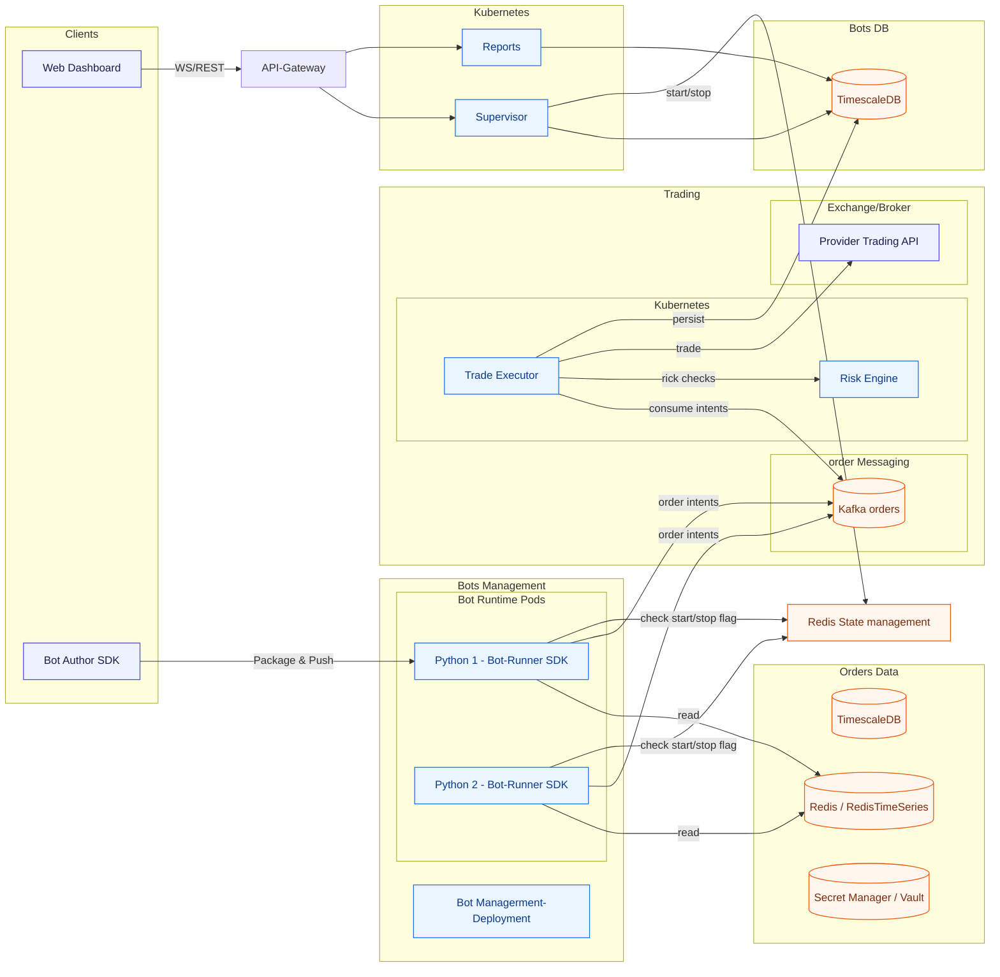

# High-Level Architecture

```mermaid
flowchart LR
  %% Styles
  classDef svc fill:#EBF5FF,stroke:#1F6FEB,stroke-width:1.2px,color:#0B3B8C
  classDef store fill:#FFF7ED,stroke:#EA580C,stroke-width:1.2px,color:#7C2D12
  classDef obs fill:#F0FDF4,stroke:#16A34A,stroke-width:1.2px,color:#064E3B
  classDef sec fill:#FEF2F2,stroke:#DC2626,stroke-width:1.2px,color:#7F1D1D
  classDef edge fill:#EEF2FF,stroke:#4F46E5,stroke-width:1.2px,color:#1E1B4B

  subgraph Clients
    D[Web Dashboard]:::edge
    BX[Bot Author SDK]:::edge
  end

  subgraph ControlPlane[Kubernetes]
    SUP[Supervisor]:::svc
    RP[Reports]:::svc
  end
  subgraph Trading
   subgraph OrderSvc[Kubernetes]
    RISK[Risk Engine]:::svc
    EXEC[Trade Executor]:::svc
  end
    
  subgraph Order queue[order Messaging]
    KAFKA_ORDER[(Kafka orders)]:::store
  end
  
  subgraph Broker[Exchange/Broker]
    BRK[Provider Trading API]:::edge
  end
  end


  subgraph Stores_order[Bots DB]
    TS_OD[(TimescaleDB)]:::store
  end
  subgraph Stores_data[Orders Data]
    direction LR
    TS_DATA[(TimescaleDB)]:::store
    REDIS[(Redis / RedisTimeSeries)]:::store
    VAULT[(Secret Manager / Vault)]:::store
  end
  
  subgraph Bot_Mng[Bots Management]
      direction LR
      subgraph Runtime[Bot Runtime Pods]
        BOT1[Python 1 - Bot-Runner SDK]:::svc
        BOT2[Python 2 - Bot-Runner SDK]:::svc
      end
      BOT_MNG[Bot Managerment-Deployment]:::svc
  end
  REDIS_BOT[Redis State management]:::store

  D -- WS/REST --> API-Gateway
  API-Gateway --> SUP
  API-Gateway --> RP
  SUP --> TS_OD
  RP --> TS_OD
  BX -- Package & Push --> BOT1


  BOT1 -- read --> REDIS
  BOT2 -- read --> REDIS
  
  BOT1 -- order intents --> KAFKA_ORDER
  BOT2 -- order intents --> KAFKA_ORDER

  EXEC -- consume intents --> KAFKA_ORDER
  EXEC -- rick checks --> RISK

  EXEC -- trade --> BRK
  EXEC -- persist --> TS_OD
  
  SUP -- start/stop --> REDIS_BOT
  BOT1 -- check start/stop flag --> REDIS_BOT
  BOT2 -- check start/stop flag --> REDIS_BOT

```
