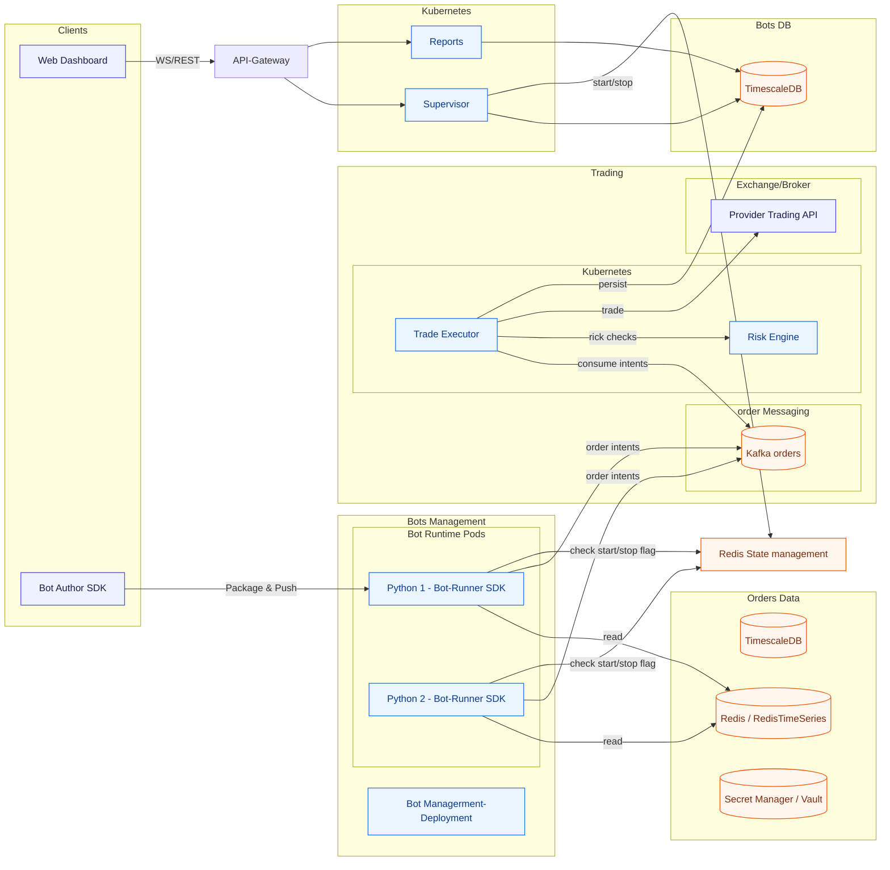
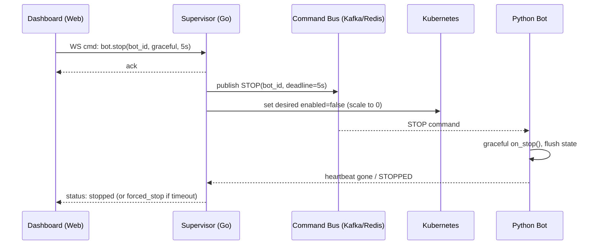
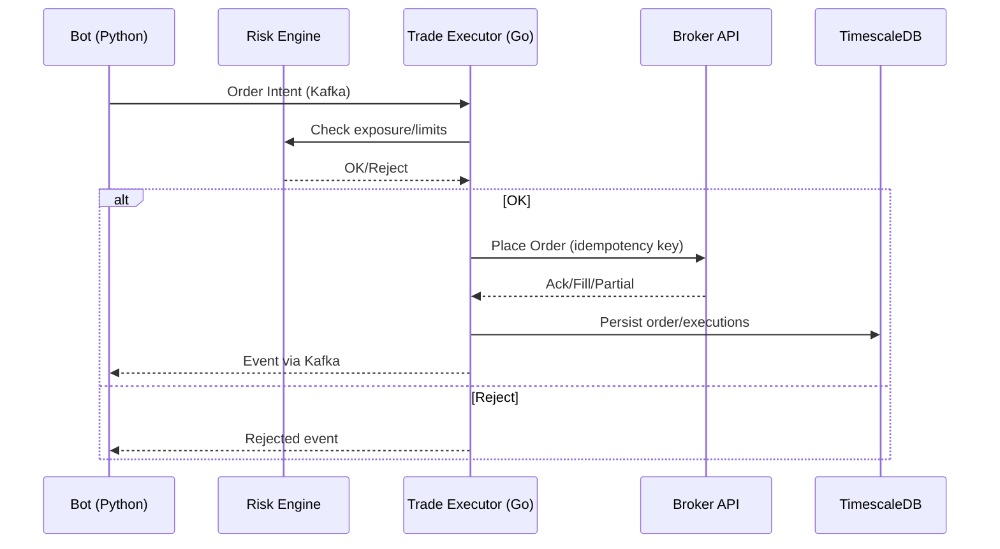

# Qubit Bot Trading Platform — Full System Design

This document captures the end-to-end architecture for the HOSE futures bot-trading platform. It codifies the components, interfaces, and operational considerations for implementing the system inside this monorepo.

## 1. High-Level Architecture



## 2. Control Plane & Realtime Operations

### 2.1 Dashboard ↔ Supervisor API (REST + WebSocket)
- **REST** (CRUD/idempotent):
  - `POST /bots` create/update desired state (image, config).
  - `GET /bots`, `GET /bots/{id}` list & details.
  - `POST /bots/{id}/rollout` change image/config.
  - `DELETE /bots/{id}` remove desired state.
- **WS** (operate now):
  - `{"type":"bot.start","bot_id": "...", "image":"...", "config_rev":12}`
  - `{"type":"bot.stop","bot_id":"...","mode":"graceful","timeout_ms":5000}`
  - Push status: `{"type":"bot.status","bot_id":"...","phase":"running"}`



### 2.2 Desired State (DB) and Status
```sql
CREATE TABLE IF NOT EXISTS desired_bots(
  bot_id UUID PRIMARY KEY,
  account_id TEXT NOT NULL,
  name TEXT NOT NULL,
  image TEXT NOT NULL,
  enabled BOOLEAN NOT NULL DEFAULT FALSE,
  config JSONB NOT NULL,
  config_rev INTEGER NOT NULL DEFAULT 1,
  created_at TIMESTAMPTZ NOT NULL DEFAULT now(),
  updated_at TIMESTAMPTZ NOT NULL DEFAULT now()
);


CREATE TABLE IF NOT EXISTS bot_status(
  bot_id UUID PRIMARY KEY,
  phase TEXT NOT NULL,               -- starting|running|stopping|stopped|error
  reason TEXT,
  image_running TEXT,
  last_heartbeat TIMESTAMPTZ,
  p95_tick_ms DOUBLE PRECISION,
  intents_per_s DOUBLE PRECISION,
  updated_at TIMESTAMPTZ NOT NULL DEFAULT now()
);
```

### 2.3 RedisTimeSeries Market Data

- The local Docker stack loads Redis with the RedisTimeSeries module enabled and
  exposes it on `localhost:6379`.
- `apps/reports/cmd/seed-marketdata` seeds canonical price/volume ticks under
  keys `markets:<ticker>:price` and `markets:<ticker>:volume` (default ticker
  `VN30F1M`). Trigger via `make marketdata-seed`.
- Go services can record real ticks by wiring `platform/redis.NewMarketSeriesStore`
  and calling `AddTick` with `MarketTick` structs (which automatically create the
  underlying series with sensible retention windows).
- Bots retrieve rolling windows using `RedisTimeSeriesMarketDataClient` from the
  Python SDK, exposing both `fetch()` and `fetch_range(start, end)` for querying
  the latest snapshot or intraday slices.

### 2.4 Kafka Test Producer

- `apps/producer` exposes an HTTP facade for injecting ad-hoc messages into Kafka.
- Configure brokers via `PRODUCER_KAFKA_BROKERS` (defaults to `localhost:9092`) and
  optionally set `PRODUCER_DEFAULT_TOPIC` for requests that omit the topic field.
- Use `make producer` to run the service locally, then `POST /api/v1/messages`
  with a JSON payload containing `value`, optional `key`, `headers`, and `topic`.

### 2.5 Hose PowerScreen Topic

- SSI PowerScreen ticks parsed by `HoseStockParser` are published to the `ssi_ps`
  Kafka topic using the [`markets.v1.SsiPsSnapshot`](../proto/markets/v1/ssi_ps.proto)
  schema.
- Snapshot fields cover depth-of-book price levels, foreign flow statistics, and
  metadata (board, raw symbol, session). Timestamps are normalised to the
  exchange timezone (UTC+7).
- Consumers should register the generated Protobuf schema with their Kafka client
  (see `proto/README.md`) to ensure forward-compatible decoding.
- `make producer` ingests the reference `.txt` samples in
  `apps/producer/internal/data`, converts rows to protobuf messages, and flushes
  them to the `ssi_ps` topic for local testing.
- `make consumer` streams the same topic, decoding protobuf payloads and
  storing each snapshot as JSON inside a Redis sorted set (`ssi_ps:<code>`)
  while also mirroring the payload to a Redis Stream (`ssi_ps_stream:<code>`)
  for realtime listeners. Downstream tools can issue `ZRANGEBYSCORE` queries to
  obtain a dataframe of ticks. Environment knobs mirror the README
  (`CONSUMER_*`).

## 3. Bot Runtime (Python) — Contract & Runner

### 3.1 Bot SDK Contract
```python
class BotBase(ABC):
    def __init__(self, config, secrets, ctx): ...
    @abstractmethod
    def on_start(self): ...
    @abstractmethod
    def on_tick(self, market)->Iterable[dict]: ...
    def on_event(self, event): pass
    def on_stop(self, reason): pass
    def health(self)->dict: return {"ok": True}
```

### 3.2 Runner Responsibilities
- Load config/secrets (from Secret Manager/K8s Secret).
- Fetch market snapshot from **Data API**.
- Emit order → Kafka.
- Heartbeat (Redis/Prometheus), metrics `/metrics`, health `/healthz`.
- Listen to Stop flag in Redis
- Graceful stop on **STOP** command or SIGTERM.

## 4. Data Plane

### 4.1 Sources of Truth
- **TimescaleDB**: all ticks/trades, orders, executions, positions, PnL.
- **Redis/RedisTimeSeries**: hot window (last 5–60 min) + aggregates (1s/1m).

### 4.2 Schema (excerpt)
```sql
-- Ticks
CREATE TABLE IF NOT EXISTS ticks(
  ts timestamptz NOT NULL,
  symbol text NOT NULL,
  price numeric NOT NULL,
  volume numeric NOT NULL,
  PRIMARY KEY(ts, symbol)
);
SELECT create_hypertable('ticks', by_range('ts'), if_not_exists => TRUE);

-- Orders & Executions
CREATE TABLE IF NOT EXISTS orders(
  id uuid PRIMARY KEY DEFAULT gen_random_uuid(),
  bot_id uuid NOT NULL,
  symbol text NOT NULL,
  side text NOT NULL CHECK (side in ('buy','sell')),
  qty numeric NOT NULL,
  price numeric,
  status text NOT NULL DEFAULT 'new',
  provider_order_id text,
  created_at timestamptz NOT NULL DEFAULT now(),
  updated_at timestamptz NOT NULL DEFAULT now()
);

CREATE TABLE IF NOT EXISTS executions(
  id uuid PRIMARY KEY DEFAULT gen_random_uuid(),
  order_id uuid NOT NULL REFERENCES orders(id),
  fill_qty numeric NOT NULL,
  fill_price numeric NOT NULL,
  fee numeric NOT NULL DEFAULT 0,
  filled_at timestamptz NOT NULL DEFAULT now()
);
```

### 4.3 Kafka Topics (example)
```
orders.intent.account.<account_id>.<bot_id>
orders.event.account.<account_id>.<bot_id>
risk.alerts.account.<account_id>
bot.commands.<bot_id>                 # STOP/RELOAD
```

## 5. Trade Execution & Risk



- **Idempotency** at broker boundary.
- Risk rules: per-order limits, daily loss caps, leverage, max concurrent orders, symbol whitelist, circuit breakers.

## 6. Security

- **Auth**: OAuth2/JWT between Dashboard ↔ Supervisor/Services.
- **mTLS** between internal services; **NetworkPolicies** to limit egress.
- **Secrets** from Vault/Secret Manager; mounted to bots via K8s Secrets (short-lived tokens refreshed daily).
- **RBAC** scopes:
  - `bots:read`, `bots:write`, `bots:operate`, `orders:read`, `risk:admin`.
- **Audit log**: who started/stopped/rolled out which bot when; store in TS or Elasticsearch.

## 7. Observability

### 7.1 Metrics (Prometheus)
- **Bot**: `bot_tick_latency_ms`, `bot_order_intents_total{side,symbol}`, `bot_on_tick_exceptions_total`, `bot_pnl_realized`, `bot_pnl_unrealized`, `bot_heartbeat_ok`.
- **Executor**: `orders_submitted_total`, `orders_rejected_total{reason}`, `broker_latency_ms`, `fills_total`.
- **Risk**: decisions, breaches, throttle counts.
- **Data API**: cache hit ratio, snapshot age.

### 7.2 Alerts (samples)
```yaml
- alert: BotNoHeartbeat
  expr: bot_heartbeat_ok == 0
  for: 30s
- alert: HighDecisionLatency
  expr: histogram_quantile(0.95, sum(rate(bot_tick_latency_ms_bucket[2m])) by (le, bot_id)) > 300
  for: 5m
- alert: BrokerErrorRate
  expr: rate(executor_broker_errors_total[5m]) > 5
  for: 10m
```

### 7.3 Logs & Traces
- JSON logs (bot_id, account_id, version, event).  
- Ship to Loki/ELK; OpenTelemetry traces around Data API & Executor.

## 8. Deployment (K8s Templates)

### 8.1 Bot Deployment (templated)
```yaml
apiVersion: apps/v1
kind: Deployment
metadata:
  name: bot-{{ bot_id }}
  labels: { app: bot, bot_id: "{{ bot_id }}", account: "{{ account_id }}", cfg: "{{ config_hash }}" }
spec:
  replicas: 1
  strategy: { type: Recreate }
  selector: { matchLabels: { app: bot, bot_id: "{{ bot_id }}" } }
  template:
    metadata:
      labels: { app: bot, bot_id: "{{ bot_id }}", account: "{{ account_id }}", cfg: "{{ config_hash }}" }
      annotations:
        prometheus.io/scrape: "true"
        prometheus.io/port: "8081"
        prometheus.io/path: "/metrics"
    spec:
      serviceAccountName: bot-runner
      containers:
      - name: bot
        image: {{ image }}
        env:
        - name: BOT_ID       ; value: "{{ bot_id }}"
        - name: ACCOUNT_ID   ; value: "{{ account_id }}"
        - name: BOT_CONFIG   ; valueFrom: { secretKeyRef: { name: bot-{{ bot_id }}-cfg, key: config.json } }
        - name: BOT_SECRETS  ; valueFrom: { secretKeyRef: { name: account-{{ account_id }}-secrets, key: broker.json } }
        ports: [ { containerPort: 8081 } ]
        resources:
          requests: { cpu: "200m", memory: "256Mi" }
          limits:   { cpu: "1",    memory: "1Gi" }
        livenessProbe:  { httpGet: { path: /healthz, port: 8081 }, periodSeconds: 5 }
        readinessProbe: { httpGet: { path: /readyz,  port: 8081 }, periodSeconds: 3 }
        securityContext:
          readOnlyRootFilesystem: true
          allowPrivilegeEscalation: false
      terminationGracePeriodSeconds: 5
```

### 8.2 NetworkPolicy (bots can only reach platform)
```yaml
apiVersion: networking.k8s.io/v1
kind: NetworkPolicy
metadata:
  name: bot-egress
spec:
  podSelector: { matchLabels: { app: bot } }
  policyTypes: ["Egress"]
  egress:
  - to:
    - namespaceSelector: { matchLabels: { ns: "trading" } }
    ports:
    - protocol: TCP
      port: 8080   # Data API
    - protocol: TCP
      port: 9092   # Kafka
```

## 9. Realtime UX (Dashboard)

- **WS** connected to Supervisor.
- Rows show: status (starting/running/stopping/stopped), image tag, cfg hash, p95 tick, intents/s, live PnL.
- Actions: Start, Stop, Rollout, View Logs, Kill Switch (account/global).
- Optimistic updates; final state from WS events.

## 10. Makefile Targets (Dev Convenience)
```Makefile
up:         ## docker compose up Timescale+Redis
down:       ## compose down -v
seed:       ## apply schema to Timescale
api:        ## run Go API
bot:        ## run Python bot locally
dev: create dev container
```
